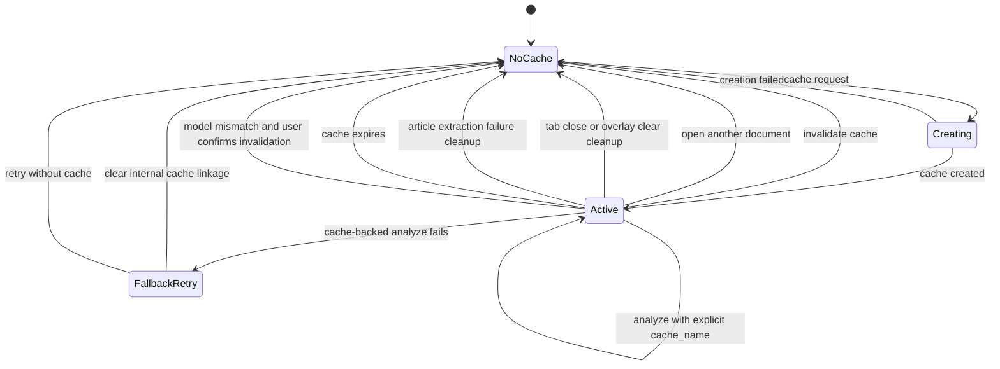

# Cache Lifecycle Diagram

This diagram describes the lifecycle of Gemini context cache integration.

## Notes

- Cache is tied to a model name.
- browser-extension sends `cache_name` only for active, model-matched article caches.
- `AIModel.analyze()` uses the explicit `cache_name` when provided; otherwise it falls back to the desktop app's internal active cache state.
- Explicit cache failures retry without cache but do not overwrite the desktop app's internal cache linkage.
- The UI countdown is driven by cache expiration time from `CacheStatus`.
