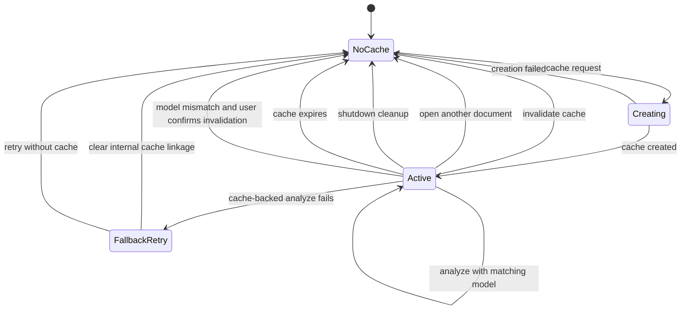

# Cache Lifecycle Diagram

This diagram describes the lifecycle of Gemini context cache integration.

## Notes

- Cache is tied to a model name.
- `AIModel.analyze()` uses cached content only when the active cache model matches the current request model.
- The UI countdown is driven by cache expiration time from `CacheStatus`.
