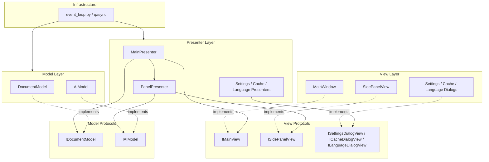

# Layer Dependency Diagram

This diagram focuses on dependency direction rather than runtime calls.

## Notes

- Qt classes belong in the view layer and infrastructure layer, not in presenters or models.
- Protocols are the dependency boundary used by presenters and tests.
