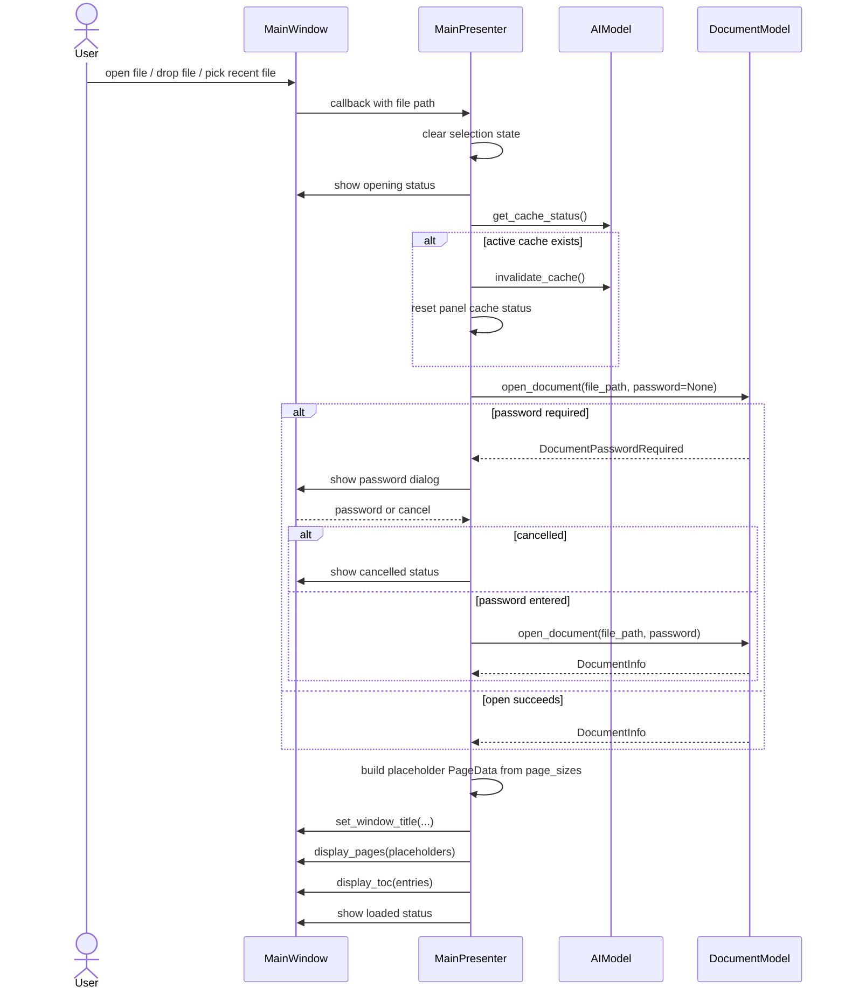

# Open File Sequence Diagram

This diagram shows the main open-document path, including cache invalidation and password retry.

## Notes

- Actual page image rendering is deferred until the view requests needed pages.
- Cache is cleared when switching documents so analysis state cannot leak across files.
