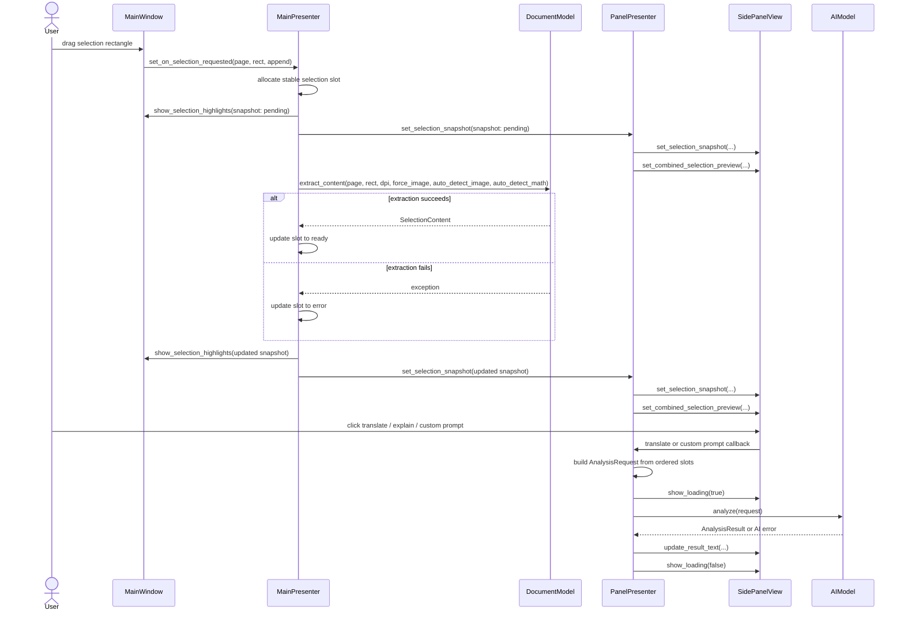

# Selection to AI Sequence Diagram

This diagram shows how a user selection becomes an AI request.

## Notes

- Selection slots preserve user order even if async extraction completes later.
- The side panel does not build model requests on its own; PanelPresenter does that orchestration.
