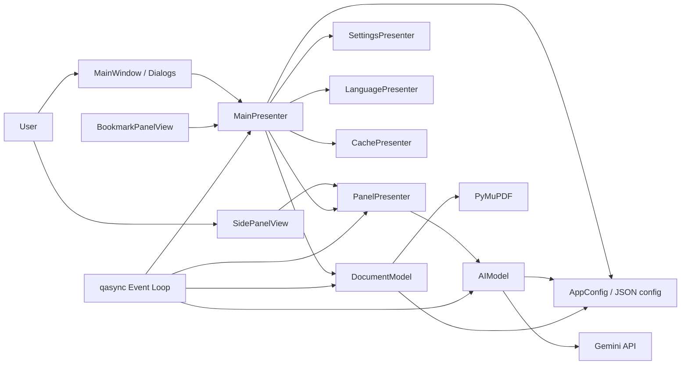

# System Overview Diagram

This diagram shows the main runtime components and external dependencies.

## Notes

- Views do not call models directly.
- Presenters orchestrate asynchronous model operations.
- qasync provides the bridge between Qt and asyncio.
